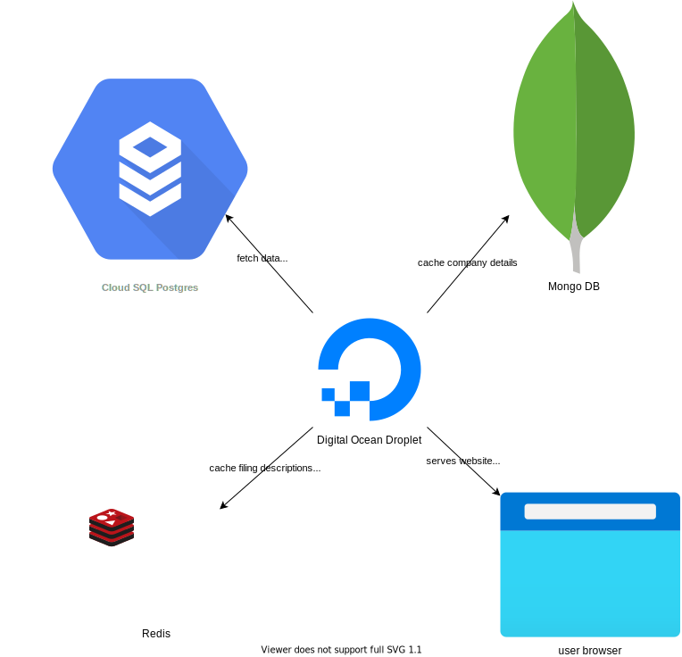

# Companies Stream

This project is a visualiser of changes made to the companies house database of UK companies. It
shows events as they happen in realtime, such as a new company registering, or a company going
insolvent.

## Technology

- NodeJS server
- WebSockets with Socket.io
- HTML frontend with pure JavaScript and CSS
- Redis, MongoDB and PostgreSQL databases

## How it works

The Node server makes a request to the companies house server, which sends a response each time there is an update. The
server does some processing on this event, such as finding more details about the company from an internal database. The
server opens a socket with each client, and emits the event through this socket. The client receives the event and
displays it.

## Databases

Companies house offers a [bulk download of company data](https://download.companieshouse.gov.uk/en_output.html) of all
UK companies, which I have loaded into a Postgres database. When an event comes in, the database is queried to get the
companies name and some other information about it. To reduce the load on my Postgres database, which is mainly used
for [Filter Facility](https://filterfacility.co.uk), I cache company information in a Mongo document database. Filing
events are sent by companies house with a filing description code rather than the actual description. They offer
a [list of all the formatted descriptions](https://github.com/companieshouse/api-enumerations/blob/master/filing_history_descriptions.yml)
, which I have also loaded into Postgres. These are cached in a Redis key-value database. The overall data caching
architecture works like this:


## Make your own

If you are interested in using the companies house streaming API,
visit [developer-specs.company-information.service.gov.uk](https://developer-specs.company-information.service.gov.uk/streaming-api/guides/overview "Companies house developer website")
to create an account for a free API key. The API base url is https://stream.companieshouse.gov.uk
with endpoints `/companies`, `/filings`, `/charges` and `/insolvency-cases`

Here is a minimum working example using TypeScript:

```typescript
import * as request from "request"; // requires $ npm i request
import {CompanyProfileEvent} from "./eventTypes"; // type definitions

export const StreamEvents = () => {

    let dataBuffer = '' // stores incoming data until it makes a complete JSON object
    const reqStream = request.get('https://stream.companieshouse.gov.uk/companies')
        .auth(process.env.APIUSER, '') // this is your API key from your companies house account
        .on('response', (r: any) => {
            if (r.statusCode === 200) console.log("Successfully connected to stream")
            else console.log("Received a status code of", r.statusCode)
        })
        .on('error', (e: any) => console.error('error', e))
        .on('data', async (d: any) => {
            if (d.toString().length > 1) {
                reqStream.pause() // pauses receiving new information from companies house

                dataBuffer += d.toString('utf8')
                dataBuffer = dataBuffer.replace('}}{', '}}\n{')
                while (dataBuffer.includes('\n')) {
                    let newLinePosition = dataBuffer.search('\n')
                    let jsonText = dataBuffer.slice(0, newLinePosition)
                    dataBuffer = dataBuffer.slice(newLinePosition + 1)
                    if (jsonText.length === 0) continue;
                    try {
                        // types are in eventTypes.ts
                        let jsonObject: CompanyProfileEvent.CompanyProfileEvent = JSON.parse(jsonText)
                        console.log("Received EVENT:", jsonObject)
                    } catch (e) {
                        if (e instanceof SyntaxError)
                            console.error(`\x1b[31mCOULD NOT PARSE event: \x1b[0m*${jsonText}*`)
                    }
                }
                reqStream.resume()// resumes receiving new information from companies house
            } else {
                console.log("Received heartbeat")
            }
        })
        .on('end', () => console.error("Stream ended"))
}

```
